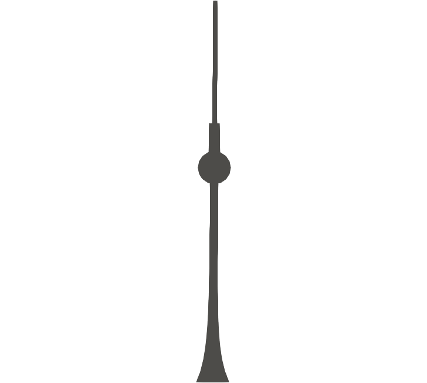
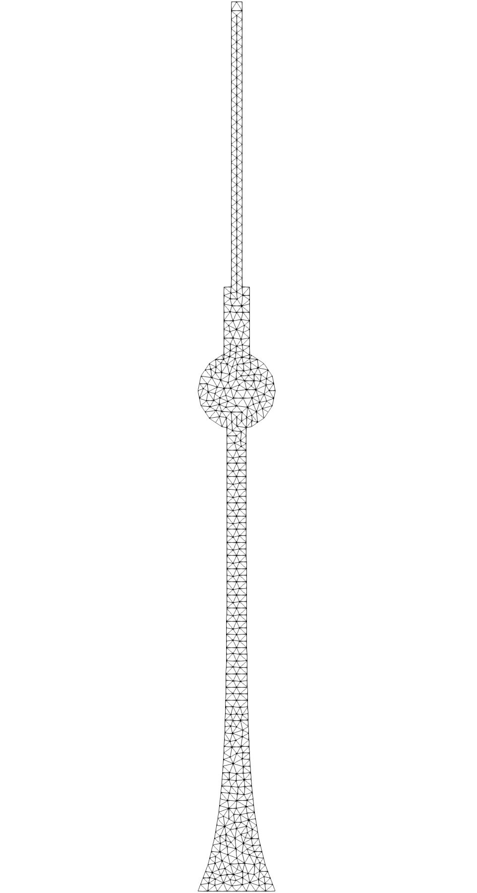

# Elastic Fernsehturm.
Demonstration of damped Hamiltonian elastodynamics with [FEniCS](https://fenicsproject.org).



This is a compact/simple demonstration of research involving variational methods for more complex/complicated nonlinearly coupled mechanical problems that involve nonlinear viscoelasticity, diffusion and phase separation, reactions and phase transitions, see e.g. [[Schmeller and Peschka, SIAP 2023]](https://doi.org/10.1137/22M148478X) or [[Peschka,Zafferi,Heltai,Thomas,JNET 2022]](https://doi.org/10.1515/jnet-2021-0081) jointly with [Luca Heltai](https://github.com/luca-heltai).

Author: Dirk Peschka

## What does this code do?

### `tvmesh.py`

Creation of a two-dimensional representation of the Berlin Fernsehturm tower as a finite element mesh.

### `tvtower.py`

1. Compact representation of a structure-preserving damped-Hamiltonian system of elastodynamics.
2. Solve and visualize the solution using the finite element library FEniCS (legacy version 2019.1.0)

It creates a plot of kinetic, potential and total energy as a function of time and creates output in `./output`. The output can be read with standard finite element visualization software such as [ParaView](https://www.paraview.org) or [visIt](https://visit-dav.github.io/visit-website/index.html).

### `tvmesh.xml`

Clone of the Fernsehturm mesh created by `tvmesh.py`. The corresponding mesh is shown below, but can be modified and refined in `tvmesh.py`.




## What do you need to run this example (properly)?

- Python
- [FEniCS](https://fenicsproject.org) legacy 2019.1.0
- [mshr](https://bitbucket.org/fenics-project/mshr/src/master/) for mesh creation in FEniCS
- Matplotlib/Pylab for visualization in Python
- [ParaView](https://www.paraview.org) or [visIt](https://visit-dav.github.io/visit-website/index.html) for external visualization 

## Short mathematical explanation of problem

The starting point of this discretization is a formulation of elastodynamics using momentum $p:\Omega\to\mathbb{R}^d$ and deformation $\chi:\Omega\to\mathbb{R}^d$, where $\Omega\subset\mathbb{R}^d$ has the shape of the TV tower and $d=2$. We put these functions into a composite vector $q=(\chi,p)$ that depends on time, i.e. $q=q(t)$ for $0\le t\le T$ with initial data $q_0=q(t=0)$. The discretization of the damped Hamiltonian system starts from a Hamiltonian (free energy)

$$
\mathcal{H}(q):=\int_\Omega \frac{|p|^2}{2\varrho} + W(F)\hskip{2mm}\mathrm{d}x
$$

using the deformation gradient $F:=\nabla\chi$. For this we define extra variables $\mathbf{\eta}:=(\eta_\chi,\eta_p)$ and identify forces via 

$$
b(\eta,v):=\int_\Omega \eta\cdot v\hskip{2mm}\mathrm{d}x\overset{!}{=}\langle \mathrm{D}\mathcal{H}(q),v\rangle
$$

where the Frechet derivative in FEniCS is conveniently obtained via `derivative(H,q,dq)`. In the actual implementation we use the displacement $w(x)$ instead of the deformation $\chi(x):=x+w(x)$. Then the elastodynamic problem is solved via

$$
a(\eta,\xi) - b(\xi,\partial_t q)=0,
$$

where $a(\eta,\xi):=j(\eta,\xi)-k(\eta,\xi)$ consists of a skew-symmetric contribution $j$ that covers reversible (Hamiltonian) dynamics and a symmetric positive contribution $k$ that covers irreversible (Onsager) dynamics. We use 

$$
j(\eta,\xi):=\int_\Omega \eta_p\cdot\xi_\chi - \xi_p\cdot\eta_\chi\hskip{2mm}\mathrm{d}x,
$$

and

$$
k(\eta,\xi):=\int_\Omega \mu\nabla\eta_p\cdot\nabla \xi_p\hskip{2mm}\mathrm{d}x.
$$

We discretize via P2 FEM for all function and a Crank-Nicolson scheme in time.

## Core part of discretization

The central part of the damped Hamiltonian structure is contained in the `evolve` function, which assembles and solves the space and time discretization of a single time step. It decomposes the state `q` and test functions `dq` into their respective components corresponding to $\eta_w,\eta_p,w,p$ called `fw,fp,w,p`, respectively. Then, the Hamiltonian $\mathcal{H}$ is defined as described above with neo-Hookean elastic energy. Then, the nonlinear residual `Res(q)` is constructed and we solve `Res(q)==0` subject to natural and essential Dirichlet boundary conditions using Newton iterations. Based on the solution of the previous time step `old_q`, fhe function returns the new state `q`and the kinetic and potential energy `E_kin` and `E_pot`.

```python
# Solve single time step
def evolve(old_q, dt):
    # unknowns, test functions and previous time step
    q,dq = Function(W),TestFunction(W)
    fw,fp,w,p                  = split(q)
    dfw,dfp,dw,dp              = split(dq)
    old_fw,old_fp,old_w, old_p = split(old_q)
    
    # Hamiltonian = kinetic + potential energy
    F = Identity(2) + grad(w)
    e_kinetic     = 0.5*p**2
    e_potential   = (mu/2)*(tr(F.T*F-Identity(2)) - 2*ln(det(F)))
    H             = (e_kinetic + e_potential)*dx
    
    # damped Hamiltonian formulation with dual variables fw,fp
    Res  = inner( (w-old_w)/dt , dfw )*dx - inner( 0.5*(fp+old_fp) , dfw )*dx
    Res += inner( (p-old_p)/dt , dfp )*dx + inner( 0.5*(fw+old_fw) , dfp )*dx 
    Res += viscosity * inner( grad(fp) , grad(dfp) )*dx
    Res += inner(fw, dw )*dx + inner(fp, dp )*dx - derivative(H, q, dq)
    
    q.assign(old_q)
    solve(Res == 0, q, [bc1,bc2])
    
    # Compute energies
    E_kin = assemble(e_kinetic*dx)
    E_pot = assemble(e_potential*dx)
    return q,E_kin,E_pot
```

